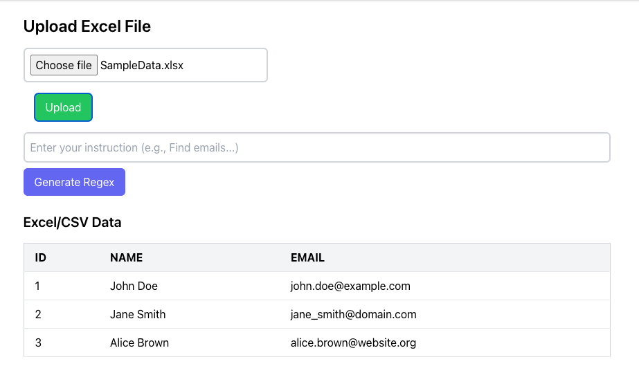
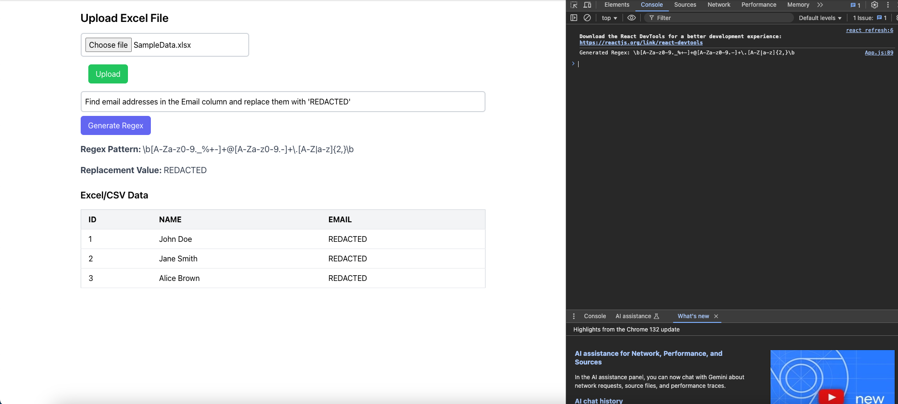

# Web Application for Regex Pattern Matching and Replacement Using LLM

This project allows users to upload Excel or CSV files, generate regex patterns (using LLM) based on user instructions, and replace matched values with specified replacements. The system is built with a **Django** backend and a **React** frontend, providing an intuitive interface for pattern matching and replacement tasks.

## Prerequisites

Ensure that you have the following installed:

- **Python** (use `python` or `python3` based on your installation)
- **Node.js** and **npm**

- **Based on the LLM you are using -** 

    ```bash
     pip install ollama
     ollama pull mistral
     ```
**Note**: I'm using `mistral` for **regex generation** and **verification** `google/flan-t5-large` for finding the **replacement word**.

## Setup Instructions

Follow these steps to set up the project:

1. **Clone the repository**:
    ```bash
    git clone https://github.com/achu1998/regex-pattern-match-llm.git
    ```

2. **Navigate to the project directory**:
    ```bash
    cd regex-pattern-match-llm
    ```

3. **Create virtual environment**:
    ```bash
    pip install pipenv
    pipenv shell
    ```

4. **Install Python dependencies**:
    Ensure you're in the root directory of the project, then run:
    ```bash
    pip install -r requirements.txt
    ```

5. **Open two terminals**:

   - In the **first terminal**, navigate to the `backend` directory and run the Django backend server:
     ```bash
     cd backend
     python3 manage.py runserver
     ```

   - In the **second terminal**, navigate to the `frontend` directory and start the React frontend:
     ```bash
     cd frontend
     npm start
     ```

   **Note**: Use `python3` instead of `python` if that's how it's installed on your system.

**Note**: Introduced a variable `enable_verfiy = False` in `regexapp\views.py` which helps in verifying the generated output. Set it to `True` if testing for verifying the generated output.   

## User Instructions for Upload and Regex Generation

### 1. **Upload Excel or CSV File**:
Once both servers are running, you can visit the frontend UI in your browser (http://localhost:3000/). To upload your file:

- Click on the **"Upload Excel File"** button to select and upload your Excel or CSV file.
- The uploaded file’s contents will be displayed in a table format.

### 2. **Try Various Instructions**:
After uploading your file, you can try different instructions that target specific data patterns, such as emails or names, in your file. The instructions will generate a corresponding regex pattern and provide a replacement value.

Here are some example instructions:

- **Find names starting with the character 'J'** in the **First Name** in the Name column and replace them with `'REDACTED'`.

- **Find email addresses** in the **Email** column and replace them with `'REDACTED'`.

- **Find names where Last Name is 'Brown'** in the **Name** column and replace them with `'REDACTED'`.

- **Find email addresses ending with '.org'** in the **Email** column and replace them with `'REDACTED'`.

- **Find names starting with 'A'** in the **First Name** in the Name column and replace them with `'REDACTED'`.

- **Find names where Last Name ends with 'e'** in the **Name** column and replace them with `'REDACTED'`.

- **Find names starting with 'Jane'** as the **First Name** in the **Name** column and replace them with `'REDACTED'`.

### 3. **UI Display**:
Once an instruction is entered, the generated regex pattern and replacement value will be displayed on the UI, showing the user what would be replaced in the file.

### **You can use the SampleData.xlsx for testing!**

### UI Example:

Here’s a screenshot of the user interface:



## Demo Video

Watch the demo of the application:

[](https://youtu.be/wyuaafh-47E)


## Troubleshooting

- If you encounter any issues, ensure both the backend and frontend servers are running correctly.
- Make sure the uploaded file is in a valid Excel or CSV format.
- Check the browser’s developer console for any errors or missing dependencies.
